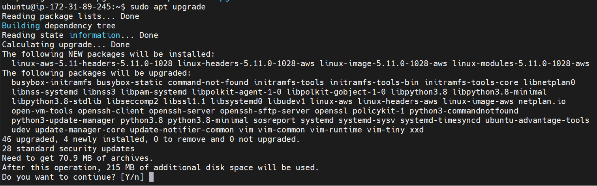

# MEAN STACK DEPLOYMENT

Update ubuntu

`sudo apt update`

Upgrade ubuntu

`sudo apt upgrade`

Add certificates 
`sudo apt -y install curl dirmngr apt-transport-https lsb-release ca-certificates`

`curl -sL https://deb.nodesource.com/setup_12.x | sudo -E bash -`

