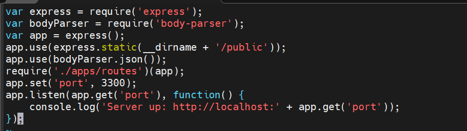

# MEAN STACK DEPLOYMENT

## INSTALL NodeJS

Update ubuntu

`sudo apt update`

Upgrade ubuntu

`sudo apt upgrade`

Add certificates 

`sudo apt -y install curl dirmngr apt-transport-https lsb-release ca-certificates`

`curl -sL https://deb.nodesource.com/setup_12.x | sudo -E bash -`

Install NodeJS

`sudo apt install -y nodejs`

## INSTALL MongoDB

`sudo apt-key adv --keyserver hkp://keyserver.ubuntu.com:80 --recv 0C49F3730359A14518585931BC711F9BA15703C6`

Install MongoDB 

`sudo apt install -y mongodb`

Start server 

`sudo service mongodb start`

Verify server is running with below code

`sudo systemctl status mongodb`

Install npm 

`sudo aptitude install -y npm`

Install body-parser package

`sudo npm install body-parser`

Create a directory 'Books'

`mkdir Books && cd Books`

In the Books directory, initialize npm project

`npm init`

Add a file named server.js

`vim server.js`

Add the code below into the server.js file

## Install Express and set up routes to the server

`sudo npm inatall express mongoose`

In 'Books' directory, create a directory named apps

`mkdir apps && cd apps`

Create file named routes.js

`vim routes.js`

Add the below code into routes.js file

In the 'apps' directory, create a directory named models

`mkdir models && cd models`

Create a file named book.js

`vim book.js`

Add the below code in the books.js file

## Access the routes with Angularjs

In the Books directory, creates a directory named public 

`mkdir public && cd public`

Create a file named scripts.js

`vim scripts.js`

Add the below code into scripts.js file

In 'public' directory, create a file named index.html

`vim index.html`

Add the below code into index.html file

In the books directory, start server!

`node server.js`

Edit inbound rules to allow connection through tcp port 3300

To test if server is running via terminal

`curl -s http://localhost:3300`

Testing server via web browser

Testing if app works

